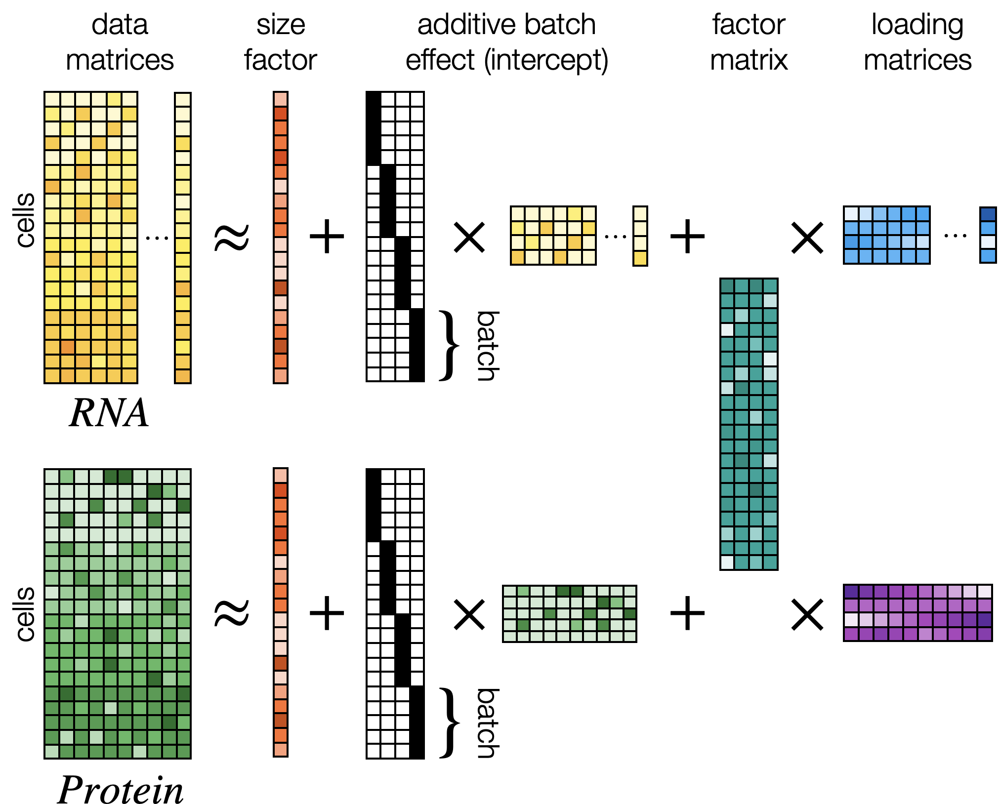

# scCCA - Single-cell canonical correlation analysis 

    

Cellular indexing of transcriptomes and epitopes by sequencing (CITE-seq) enables paired measurements of transcriptome-wide gene expression and surface proteins in single cells. While CITE-seq represents a promising way to associate cellular phenotypes with transcriptional variation, it also challenges unsupervised integration approaches due to the technical characteristics of each measured modality. Methods based on weighted-nearest neighbours, variational autoencoder and multi-view latent factor models have been proposed to address this challenge, but often these either lack interpretability, or require careful considerations regarding the preprocessing of the input data, thereby impeding the workflows of practitioners. Here we propose single cell canonical correlation analysis (scCCA), a principled hierarchical bayesian model that enables the integration of CITE-seq data while preserving the interpretability of linear latent factor models and operating on raw data counts. To evaluate scCCA’s performance, we test scCCA extensively on simulated data and assess its utility by applying it to multiple CITE-seq datasets. We demonstrate that scCCA represents a robust solution for the joint dimensionality reduction in single-cell multimodal data yielding identifiable factors that represent biologically meaningful axes of variation.

